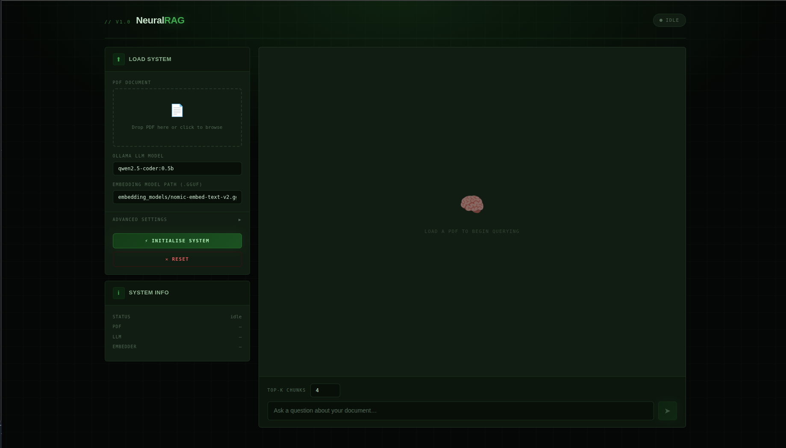

# 🧠 NeuralRAG — Local RAG Chatbot

<p align="center">
  
</p>
> **Ask questions about any PDF — entirely on your own machine.**
> No cloud, no API keys, no data leaving your device.

Built with **LangChain**, **FAISS**, **llama-cpp-python**, and **Ollama** — served through a sleek dark-green terminal-themed web UI.

---

## ✨ Features

- 📄 **PDF ingestion** — drag-and-drop any PDF and it's ready to query in minutes
- 🔍 **Semantic search** — FAISS vector store with GGUF embedding models
- 🤖 **Local LLM** — powered by Ollama; works with Llama 3, Qwen, Mistral, and more
- ⚙️ **Fully configurable** — chunk size, overlap, temperature, top-p, context window, and retrieval k — all adjustable from the UI
- 🌐 **Web interface** — beautiful black × dark-green terminal UI, no framework required
- 🔒 **100% local** — your documents never leave your machine

---

## 📋 Requirements

| Requirement | Version |
|---|---|
| Python | 3.10+ |
| Ollama | Latest |
| A GGUF embedding model | e.g. `nomic-embed-text-v2.gguf` |
| RAM | 8 GB minimum (16 GB recommended) |

---

## 🗂️ Project Structure

```
rag_chatbot/
├── api.py                        # FastAPI backend
├── static/
│   └── index.html                # Web UI frontend
├── src/
│   ├── document_processor.py     # PDF loading & chunking
│   ├── embeddings.py             # GGUF embedding model wrapper
│   ├── llm.py                    # Ollama LLM wrapper
│   ├── rag_pipeline.py           # RAG chain (retrieve → prompt → generate)
│   └── vector_store.py           # FAISS vector store
├── utils/
│   └── config.py                 # YAML config loader
├── embedding_models/
│   └── nomic-embed-text-v2.gguf  # Your embedding model (download separately)
├── uploads/                      # Auto-created; stores uploaded PDFs
├── vector_store/                 # Auto-created; stores FAISS index
└── config.yaml                   # Optional YAML config
```

---

## 🚀 Quick Start

### 1 — Clone & set up the environment

```bash
git clone <your-repo-url>
cd rag_chatbot
conda create -n nlp python=3.10 -y
conda activate nlp
```

### 2 — Create conda env and install Python dependencies

```bash
conda create -n neural_rag python=3.10
```

```bash
pip install -r requirements.txt
```

> **GPU acceleration (optional):** For faster embeddings with CUDA:
> ```bash
> CMAKE_ARGS="-DLLAMA_CUDA=on" pip install llama-cpp-python --force-reinstall
> ```

### 3 — Install Ollama and pull a model

Download Ollama from [ollama.com](https://ollama.com), then:

```bash
ollama pull qwen2.5-coder:0.5b   # lightweight, fast
# or
ollama pull llama3:8b             # higher quality
```

Start the Ollama server (keep this running):

```bash
ollama serve
```

### 4 — Download an embedding model

Download a GGUF embedding model and place it in the `embedding_models/` folder:

```bash
mkdir -p embedding_models
# Example: download nomic-embed-text from HuggingFace
# Place the .gguf file at: embedding_models/nomic-embed-text-v2.gguf
```

> A good free option: [nomic-embed-text-v2 on HuggingFace](https://huggingface.co/nomic-ai/nomic-embed-text-v2-gguf)

### 5 — Set up the frontend

```bash
mkdir -p static
cp index.html static/
```

### 6 — Run the server

```bash
uvicorn app:app --reload --port 8000
```

> **If you have a SOCKS proxy set** (common with VPNs), unset it first:
> ```bash
> env -u ALL_PROXY -u all_proxy -u HTTP_PROXY -u HTTPS_PROXY uvicorn api:app --reload --port 8000
> ```

Open your browser at **[http://localhost:8000](http://localhost:8000)** 🎉

---

## 🖥️ Using the Web UI

### Step 1 — Load your document

1. **Drag and drop** a PDF onto the upload zone (or click to browse)
2. Set your **Ollama model name** (must match what you pulled, e.g. `qwen2.5-coder:0.5b`)
3. Set the **embedding model path** (e.g. `embedding_models/nomic-embed-text-v2.gguf`)
4. *(Optional)* Open **Advanced Settings** to tune chunking and generation parameters
5. Click **⚡ INITIALISE SYSTEM**

The status badge will cycle: `IDLE → LOADING → READY`

> Loading can take **1–3 minutes** the first time while embeddings are generated.

### Step 2 — Chat

Once the badge shows **READY**, type your question and press **Enter**.

Use **Shift + Enter** for multi-line questions.

Adjust **Top-K Chunks** above the input to control how much document context is retrieved per query (higher = richer context, slightly slower).

### Step 3 — Reset

Click **✕ Reset** to unload the current document and start fresh with a new PDF or different settings.

---

## ⚙️ Advanced Settings Reference

| Setting | Default | Description |
|---|---|---|
| Chunking Method | `recursive_character` | How the PDF is split into chunks |
| Chunk Size | `1000` | Characters per chunk |
| Chunk Overlap | `200` | Overlap between adjacent chunks |
| Temperature | `0.7` | LLM randomness (0 = deterministic, 1 = creative) |
| Top-P | `0.9` | Nucleus sampling threshold |
| Context Window (n_ctx) | `2048` | Token context window for the embedding model |
| Max Output Tokens | `2048` | Maximum tokens in the LLM's response |
| Vector Store Path | `vector_store` | Where the FAISS index is saved on disk |
| Top-K Chunks | `4` | Retrieved chunks per query (set in chat bar) |

---

## 🔧 API Reference

The FastAPI backend exposes the following endpoints. You can also access the interactive docs at **[http://localhost:8000/docs](http://localhost:8000/docs)**.

| Method | Endpoint | Description |
|---|---|---|
| `GET` | `/status` | Get current system status and loaded model info |
| `POST` | `/load` | Upload a PDF and initialise the RAG pipeline |
| `POST` | `/infer` | Submit a query and get an answer |
| `DELETE` | `/reset` | Tear down the loaded pipeline |

### Example: query via `curl`

```bash
curl -X POST http://localhost:8000/infer \
  -H "Content-Type: application/json" \
  -d '{"query": "What is the main topic of this document?", "k": 4}'
```

---

## 🐛 Troubleshooting

| Problem | Solution |
|---|---|
| `ValueError: Unknown scheme for proxy URL` | Run with `env -u ALL_PROXY -u all_proxy uvicorn api:app --port 8000` |
| `RuntimeError: Directory 'static' does not exist` | Run `mkdir static && cp index.html static/` |
| `FileNotFoundError: Embedding model not found` | Check the path in the UI matches the actual `.gguf` location relative to where you run `uvicorn` |
| `Connection refused` on Ollama | Make sure `ollama serve` is running in a separate terminal |
| `faiss` import error | Run `pip install faiss-cpu` |
| `llama_cpp` build fails | Install build tools: `sudo apt install build-essential cmake` (Linux) or Xcode CLI tools (Mac) |
| Port already in use | Change port: `uvicorn api:app --port 8001` |
| Slow embedding generation | Normal for first run; subsequent loads reuse the saved FAISS index |

---

## 🤖 Recommended Models

### LLM (via Ollama)

| Model | Size | Quality | Speed |
|---|---|---|---|
| `qwen2.5-coder:0.5b` | ~400 MB | Good | Very fast |
| `llama3.2:3b` | ~2 GB | Better | Fast |
| `llama3:8b` | ~5 GB | Best | Moderate |
| `mistral:7b` | ~4 GB | Great | Moderate |

### Embedding Models (GGUF)

| Model | Size | Notes |
|---|---|---|
| `nomic-embed-text-v2.gguf` | ~300 MB | Great general purpose, recommended |
| `mxbai-embed-large.gguf` | ~670 MB | Higher quality embeddings |

---

## 📜 License

MIT License — free to use, modify, and distribute.

---


# UI 

<p align="center">
  
</p>

